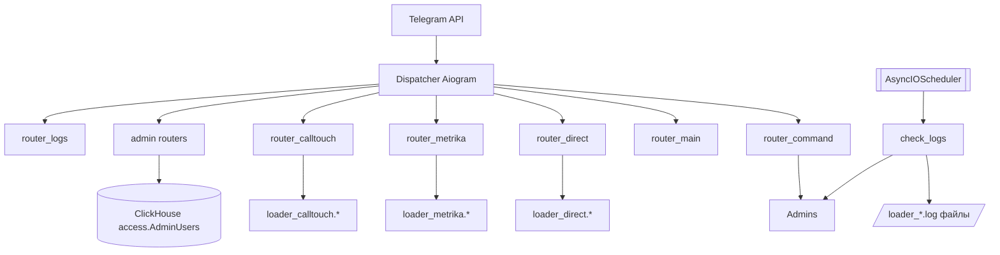
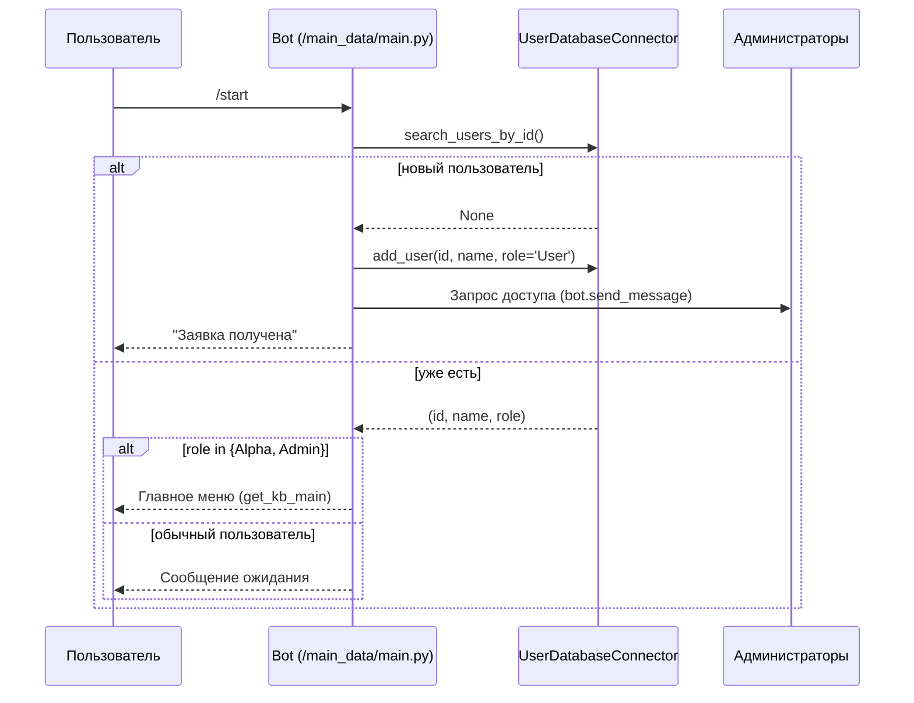

# admin_bot

Telegram‑бот для администраторов Make Digital, который управляет доступами пользователей, конфигурациями клиентов в разных сервисах (Yandex.Metrica, Yandex.Direct, Calltouch), а также отслеживает ошибки рабочих пайплайнов по лог‑файлам. Проект построен на **Aiogram 3**, **APScheduler** и асинхронных драйверах БД.

## Основные возможности
- Регистрация и авторизация пользователей через `/start` с автоматической рассылкой запросов доступа администраторам (`main_data/command.py`).
- Панель управления (инлайн‑клавиатуры из `main_data/keyboard.py`) для доменов: Metrika, Direct.
- Админ‑панель умеет запускать change tracker Метрики и Директа сразу по всем клиентам.
- Работа с ролями и правами в ClickHouse (таблица `AdminUsers` в БД `access`, заданной в `loaders.yaml`): роли `User`, `Alpha`, `Admin`.
- Управление конфигурациями клиентов во внешних БД (`loader_*`) через специализированные роутеры.
- Отправка CSV/текстовых отчётов прямо в Telegram и запуск интеграций (change tracker, pipe) из чатов.
- Фоновый мониторинг логов через `APScheduler` и автоматические уведомления об ошибках (`main_data/logs_handler.py`).

## Архитектура



## Структура репозитория

Проект следует принципам чистой архитектуры с разделением ответственности:

```
admin_bot/
├── app.py                    # Точка входа приложения
├── config/
│   ├── __init__.py
│   └── settings.py          # Настройки из .env (токены, деплойменты и т.д.)
├── handlers/                 # Обработчики команд и callback'ов
│   ├── __init__.py
│   ├── commands.py          # /start, /a, /reg
│   ├── callbacks.py         # Обработчики главного меню
│   ├── direct.py            # Yandex.Direct FSM обработчики
│   ├── metrika.py           # Yandex.Metrika FSM обработчики
│   └── logs.py              # Мониторинг логов
├── admin/
│   ├── handlers.py          # Админ-панель (управление пользователями, bulk uploads)
│   └── keyboards.py         # Клавиатуры админ-панели
├── keyboards/
│   ├── __init__.py
│   └── inline.py            # Inline-клавиатуры
├── database/
│   ├── __init__.py
│   └── user.py              # ClickHouse коннектор для пользователей
├── services/
│   ├── __init__.py
│   └── prefect_client.py    # Интеграция с Prefect API
└── logs/                     # Логи бота (создаётся автоматически)
```

> В проекте предполагается наличие соседних пакетов `loader_direct`, `loader_metrika`, `loader_calltouch`, `loader_custom_pipe`, `loader_vk` (см. абсолютные пути в коде). Они должны лежать рядом с репозиторием (`/home/make/dirloader_base/...`) или быть доступны через `PYTHONPATH`.

## Логика и связи

### Поток авторизации



- `/a` открывает админ‑панель только для `Admin`. Остальным пользователям отправляется запрос доступа администраторам (тот же механизм рассылки).
- Переходы между разделами выполняются через callback data `command_*`, обрабатываются в `main_data/main_handlers.py`.

### Основные роутеры и их обязанности

| Роутер | Файл | Основные методы/состояния | Особенности |
| --- | --- | --- | --- |
| `router_command` | `main_data/command.py` | `/start`, `/a`, `/reg` | Регистрация пользователей в ClickHouse (AdminUsers в БД access из `loaders.yaml`) и выдача клавиатур. Одноразовая регистрация администратора через код. |
| `router_main` | `main_data/main_handlers.py` | `command_*` callbacks | Переключение между разделами (главное меню, админ‑панель, домены). |
| `router_direct` | `main_data/direct_handlers.py` | `AddDirectClient`, `RemoveDirectClient`, `UpdateDataDirectClient` | Объединяет секреты/модули `loader_direct` и `loader_metrika`, запускает change tracker по логину. |
| `router_metrika` | `main_data/metrika_handlers.py` | `MetrikaStates` (`add/remove/update`) | Управление таблицей конфигураций метрики, генерация CSV, запуск change tracker по счётчику. |
| `router_calltouch` | `main_data/calltouch_handlers.py` | `CalltouchStates` (`add/remove/update`) | Работает с `AsyncCalltouchDatabase`, запускает pipe `process_single_client(site_id, tdelta)`. |
| `router_logs` | `main_data/logs_handler.py` | `/lgs`, `/lgs_res`, `check_logs()` | Читает внешние логи и уведомляет админов при `Error`. |
| `router_admin_*` | `admin/handlers.py` | FSM по добавлению/удалению ролей | Используют `UserDatabaseConnector` для смены ролей. |

### Prefect интеграция для массовых выгрузок

- Запуски из админ‑бота выполняются **только через Prefect**; локальный fallback отключён.
- Укажите деплойменты через переменные окружения (опционально — иначе будут использованы стандартные имена деплойментов):
  - `PREFECT_DEPLOYMENT_METRIKA_ALL` — деплоймент `metrika_loader_flow` с параметром `track_changes=True` (по умолчанию используется `metrika-loader-clickhouse/metrika-loader-clickhouse`).
  - `PREFECT_DEPLOYMENT_DIRECT_ALL` — деплоймент `direct_loader_flow` (бот передаёт `profile=analytics|light`; по умолчанию `direct-loader-clickhouse/direct-analytics-change` для analytics и `direct-loader-clickhouse/direct-light-hourly` для light).
  - Опционально `PREFECT_DEPLOYMENT_DIRECT_ANALYTICS` / `PREFECT_DEPLOYMENT_DIRECT_LIGHT` для разных деплойментов.
- Бот помечает такие запуски тегами `admin_bot`, `bulk_upload`. Если деплоймент не настроен или Prefect недоступен, бот сообщит об ошибке и не запустит задачу.

### Prefect интеграция для точечных выгрузок

- Все точечные обновления (Direct по одному логину, Метрика по одному счётчику) запускаются через Prefect:
  - `PREFECT_DEPLOYMENT_DIRECT_SINGLE` (общий) или раздельные `PREFECT_DEPLOYMENT_DIRECT_SINGLE_ANALYTICS` / `PREFECT_DEPLOYMENT_DIRECT_SINGLE_LIGHT` — деплоймент `direct_loader_flow` с параметрами `track_changes=True`, `profile`, `login` (по умолчанию `direct-loader-clickhouse/direct-analytics-change` или `direct-loader-clickhouse/direct-light-hourly`).
  - `PREFECT_DEPLOYMENT_METRIKA_SINGLE` (или `PREFECT_DEPLOYMENT_METRIKA_ALL` в качестве fallback) — деплоймент `metrika_loader_flow` с `track_changes=True`, `counter_id` (по умолчанию `metrika-loader-clickhouse/metrika-loader-clickhouse`).
- Теги для точечных запусков: `admin_bot`, `single_upload`. При ошибке создания Prefect run бот сообщит об ошибке и не запустит локальный процесс.

### Хранилища
- **ClickHouse (`AdminUsers` в БД `access`)** — таблица пользователей бота (Telegram ID, имя, роль). Используется для авторизации и прав.
- **Внешние БД** — предоставляются пакетами `loader_direct`, `loader_metrika`, `loader_calltouch`, `loader_custom_pipe`, `loader_vk`.

### Мониторинг логов
- `main_data/logs_handler.py` содержит `log_files` со списком абсолютных путей к лог‑файлам; при каждом запуске `check_logs()` читаются только новые данные (по смещению `last_size`).
- Каждая строка, содержащая `ERROR|error|Error`, отправляется всем администраторам в HTML (`<pre>…</pre>`).
- Команда `/lgs` отправляет сводку размеров файлов и непрочитанных байтов.
- Команда `/lgs_res` сбрасывает смещения (полезно после ротации логов).

## Методы и сервисы

### `database/user.py :: UserDatabaseConnector`

| Метод | Параметры | Описание |
| --- | --- | --- |
| `initialize()` | — | Создаёт таблицу ClickHouse при первом запуске. |
| `add_user(user_id, name, role)` | int, str, str | Добавляет запись, если id ещё не существует. |
| `delete_user(user_identifier)` | id либо имя | Удаляет по ID или имени. |
| `get_user_ids_by_role(role)` | str | Возвращает список ID для роли (`Admin`, `Alpha`, `User`). |
| `search_users_by_id(user_id)` | int | Возвращает `(id, name, role)` или `None`. |
| `get_administrators()` / `get_alpha()` | — | Списки словарей `{id, name}`. Используется в админ‑панели для отображения. |
| `set_user_to_admin/alpha/user(user_id)` | int | Переключает роль, фиксируя изменения в БД. |

> Таблица пользователей хранится в ClickHouse (`AdminUsers` в БД `access`) и использует ReplacingMergeTree для обновления ролей.

### Ключевые обработчики
- `main_data/direct_handlers.py`:
  - `handle_yd_clients` → выгружает CSV со всеми логинами из `AsyncDatabase`.
  - `process_add_yd_client` → ожидает `login token`, нормализует логин, добавляет клиента через `add_other_client_list_to_table`.
  - `process_update_client` → запускает change tracker для выбранного профиля (через Prefect если настроен, иначе локально).
- `main_data/metrika_handlers.py`:
  - `process_add_ym_client` → формат `fact_login counter_metric token`.
  - `process_update_ym_data` → принимает один `counter_metric` и запускает `refresh_data_with_change_tracker`.
- `main_data/calltouch_handlers.py`:
  - `process_add_ch_client` → формат `account site_id token`.
  - `process_update_ch_data` → формат `site_id timedelta`, вызывает `process_single_client`.
- `admin/handlers.py`:
  - `add_new_admin_start_handler` → выводит текущих админов, ожидает ID.
  - `process_remove_admin` → переводит пользователя в роль `User`.
  - `process_add_new_alpha` → повышает до `Alpha`.

## CLI / Форматы аргументов

Проект предоставляет два слоя CLI:

1. **Запуск из терминала** (shell):
   | Команда | Аргументы | Назначение |
   | --- | --- | --- |
   | `python -m venv .venv` | — | Создать виртуальное окружение. |
   | `source .venv/bin/activate` | — | Активировать окружение (Windows: `.venv\Scripts\activate`). |
   | `python -m pip install -r requirements.txt` | `--extra-index-url ...` (опц.) | Установка зависимостей. Файл `requirements.txt` нужно составить согласно разделу «Зависимости». |
   | `PYTHONPATH=".:$PYTHONPATH" python -m main_data.main` | `--log-level=INFO` (стандартный аргумент интерпретатора) | Запуск бота; дополнительные аргументы Python (`-O`, `-X dev`, `-m`) можно использовать по необходимости. |

2. **Интерактивный CLI в Telegram** — каждая операция требует строки с аргументами. Ниже перечислены форматы (регистр не учитывается, аргументы разделяются пробелами):

| Раздел | Callback/Команда | Ожидаемые аргументы | Пример |
| --- | --- | --- | --- |
| Админ‑панель | `add_admin` | `telegram_id` | `523456789` |
| Админ‑панель | `add_alpha` | `telegram_id` | `523456789` |
| Админ‑панель | `remove_admin` | `telegram_id` | `523456789` |
| Metrika | `command_add_ym_clients` | `yandex_login counter_metric token` | `client_login 1234567 y0_example_token` |
| Metrika | `command_remove_ym_clients` | `counter_metric` | `1234567` |
| Metrika | `command_upload_ym_data` | `counter_metric` | `1234567` |
| Direct | `command_add_yd_agent` | `login token [container]` (login можно опустить или `-`; сохраняется как `agency_token`) | `agency-login yandex_auth_token agency-tag` |
| Direct | `command_add_yd_client` | `login token [container]` (login обязателен; сохраняется как `not_agency_token`) | `brand-login yandex_auth_token clients` |
| Direct | `command_remove_yd_clients` | `login` | `brand-login` |
| Direct | `command_upload_yd_data` | 1) выбрать профиль (`direct_profile_analytics` / `direct_profile_light`), 2) `login` | `client-login` |
| Calltouch | `command_add_ch_clients` | `account site_id token` | `brand 166611 secret_token` |
| Calltouch | `command_remove_ch_clients` | `site_id` | `166611` |
| Calltouch | `command_upload_ch_data` | `site_id timedelta_days` | `166611 50` |
| Logs | `/lgs` | — | Получить статус чтения логов. |
| Logs | `/lgs_res` | — | Сбросить позицию чтения логов. |
| Admin | `/reg` | `code` | `/reg your_registration_code` |

## Порядок запуска

1. **Подготовьте окружение**
   - Python 3.10+.
   - Установите внешние пакеты `loader_direct`, `loader_metrika`, `loader_calltouch`, `loader_custom_pipe`, `loader_vk` рядом с проектом либо добавьте их в `PYTHONPATH`.
   - Создайте `.venv` и установите зависимости: `aiogram>=3.2`, `apscheduler`, `clickhouse-connect`, `pandas`, `python-dotenv` (если решите вынести токен из `secret.py`).

2. **Настройте конфиденциальные данные**
   - В корневом `.env` файле установите `ADMIN_BOT_TOKEN` (или `TELEGRAM_BOT_TOKEN`)
   - В `.env` установите `ADMIN_REGISTRATION_CODE` для одноразовой регистрации первого администратора
   - Все настройки загружаются автоматически через `config/settings.py`

3. **Подготовьте БД**
  - Таблица пользователей создаётся скриптом `config/clickhouse_setup/init.sh` (или вручную).
  - Для работы бота нужны права `SELECT`, `INSERT`, `ALTER` на `AdminUsers` в БД `access`.

4. **Проверьте пути логов**
   - Обновите `log_files` в `handlers/logs.py`, если лог‑файлы находятся в других каталогах.

5. **Запустите бота**
   ```bash
   python app.py
   ```
   - По старту бот удаляет webhook (`bot.delete_webhook(drop_pending_updates=True)`) и начинает polling.

## Планировщик и его настройка

- Планировщик создаётся в `app.py` (`scheduler = AsyncIOScheduler()`), запускается в `startup_handler`.
- Текущая задача:
  ```python
  scheduler.add_job(
      check_logs,
      "interval",
      seconds=settings.LOG_CHECK_INTERVAL,  # 2100 секунд (35 минут)
      args=(bot,)
  )
  ```
- **Изменить интервал:** установите переменную окружения `LOG_CHECK_INTERVAL` или отредактируйте значение в `config/settings.py`. После пересохранения перезапустите бота.
- **Добавить задачу:** вызовите `scheduler.add_job(<coroutine>, trigger, **kwargs)` внутри `startup_handler`.
- **Запустить вручную:** импортируйте `check_logs` и выполните `asyncio.run(check_logs(bot))` в отдельном скрипте (бот должен быть авторизован, иначе используйте `Bot(token=...)` для stand‑alone вызова).
- **Отключить:** удалите `scheduler.add_job(...)` или вызовите `scheduler.remove_all_jobs()` до `scheduler.start()`.

## Логи и отладка
- Основной лог бота (`logs/bot.log`) содержит события Aiogram/APScheduler.
- `handlers/logs.py` ведёт мониторинг внешних логов и уведомляет администраторов.
- При отладке интеграций Direct/Metrika полезно смотреть внешние логи (пути заданы в `log_files`).
- Команды `/lgs` и `/lgs_res` доступны только администраторам — проверяется через `UserDatabaseConnector.get_admin_user_ids`.

## Работа с ролями
- Роли `Admin` и `Alpha` получают доступ к основным разделам, `User` видит только сообщение ожидания.
- Добавление/удаление ролей доступно из админ‑клавиатуры (`get_kb_admin`).
- Все операции проходят через FSM — бот явно ожидает ID, пока не завершит сценарий, после чего состояние очищается `state.clear()`.

## Зависимости (минимальный список)
- `aiogram>=3.2`
- `apscheduler>=3.10`
- `clickhouse-connect`
- `pandas`
- `python-dotenv` (если переносите токен в `.env`)

Добавьте необходимые декларации в `requirements.txt` перед установкой.

## Полезные заметки
- Все настройки централизованы в `config/settings.py` и загружаются из `.env`
- Для новых доменов следуйте паттерну: создайте новый файл в `handlers/`, определите FSM состояния, добавьте роутер в `app.py`
- Все токены и секреты хранятся в `.env` файле (никогда не коммитьте их в VCS)
- Структура проекта следует принципам чистой архитектуры с разделением ответственности
