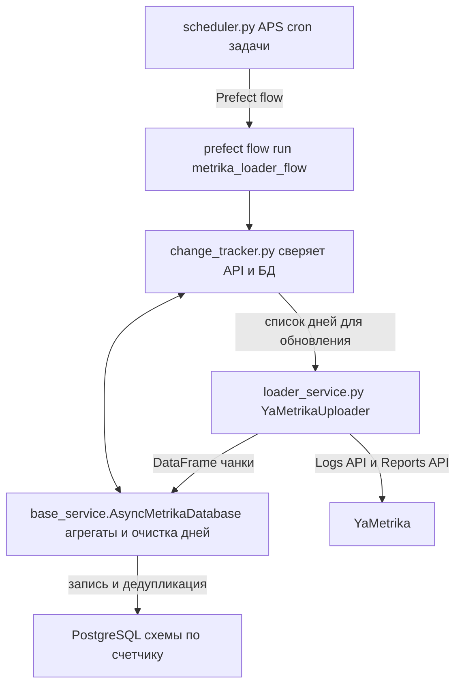

# loader_metrika

## 1. Назначение

Проект решает задачу регулярной синхронизации логов Метрики с внутренним хранилищем. Основные возможности:

- пакетная и выборочная (по дням) выгрузка логов через Logs API и Reporting API Метрики;
- автоматическое создание/расширение таблиц в Postgres и дедупликация визитов;
- сопоставление данных API с уже загруженными агрегатами (change tracker) и дозагрузка только изменившихся дней;
- планировщик, который запускает change tracker несколько раз в день без участия оператора.

## Настройка `.env`

1. Скопируйте шаблон: `cp .env.example .env`.
2. Заполните переменные:
   - `DB_HOST`, `DB_PORT`, `DB_NAME`, `DB_USER`, `DB_PASSWORD` — параметры Postgres; URL собирается автоматически.
3. OAuth-токены клиентов/агентств берутся из ClickHouse таблицы `Accesses`. Все токены управляются через admin bot.

## 2. Архитектура и поток данных

Поток ниже отражает расписание, анализ изменений и загрузку в хранилище:



## 3. Модули и их методы

Код `prefect_loader/connectors/metrika_loader` разделён на небольшие модули:
- `access.py` — сбор токенов и счётчиков из ClickHouse `Accesses`.
- `change_utils.py` — утилиты change tracker (логгер, лимитер запросов, классификация целей).
- `uploader.py` — класс `YaMetrikaUploader` для работы с Logs/Reporting API.
- `jobs.py` — планирование перезагрузок.
- `operations.py` — массовые перезагрузки, отправка событий Prefect, чтение/запись данных по заданиям и утилиты для чанкования дат.
- `loader_service.py` — точка реэкспорта для совместимости c ботом/Prefect (CLI убран).

### 3.1 `base_service.AsyncMetrikaDatabase`

Асинхронный слой работы с PostgreSQL (SQLAlchemy + asyncpg).

- **Конфигурация соединения** (`DB_URL`, `DB_POOL_SIZE`, семафор `DB_WRITE_SEMAPHORE_LIMIT`) задаёт пул подключений и количество одновременных вставок.
- **`initialize()` / `init_engine_with_retries()`** — ленивый старт движка с повторными попытками подключения (до 10 раз, с задержками). Выбрасывает `ConnectionError`, если база недоступна.
- **`create_metrika_config_table()`** — создаёт служебную таблицу `public.metrika_config` (поля: `fact_login`, `counter_metric`, `token`, `date`). Используется для хранения токенов клиентов.
- **`add_client_to_metrika_config()`** / **`delete_client_by_counter_metric()`** / **`get_metrika_config_data()`** — CRUD-операции над конфигурацией клиентов.
- **`create_schema_if_not_exists()`** и **`create_table_from_dataframe()`** — создают схему и таблицу для каждого счётчика (обычно имя вида `m_123456`). Колонки строятся из структуры DataFrame, типы подбираются автоматически.
- **`add_columns_to_table()`** и **`delete_column_from_table()`** — динамическое изменение структуры (ALTER TABLE). Имена очищаются от недопустимых символов.
- **`write_dataframe_to_table()`** — центральный метод записи данных:
  - разбивает данные на чанки согласно ограничению Postgres по количеству параметров;
  - добавляет отсутствующие колонки;
  - выполняет вставку под управлением семафора, чтобы не перегружать пул;
  - после успешной записи вызывает **`remove_duplicate_visitIDs()`**, чтобы оставить по одному визиту (по колонке `visitID`/`visit_id`).
- **`get_daily_summary()`** — агрегирует данные из таблицы счётчика: `date_trunc('day', dateTime)` + сумма визитов и суммарные конверсии по колонкам `u_goal_*`. Используется change tracker'ом.
- **`erase_data_in_interval()`** — удаляет записи в интервале дат (по `dateTime`). Запускается перед перезагрузкой дня.
- **`delete_all_tables()`** — утилита для полного сброса всех отражённых таблиц (использовать осторожно).
- **Accesses (новое)** — если в ClickHouse таблице `Accesses` есть сервис `metrika`, белый список счётчиков собирается автоматически: сначала берутся явные токены с `login/container = counter_id`, затем добавляются избранные (`favorite=1`) счётчики из всех агентских токенов (`type = metrika:agency*`). В приоритете остаются явные токены, чтобы не перезаписать их агентскими.


### 3.2 `uploader.YaMetrikaUploader`

Класс, отвечающий за получение и загрузку данных конкретного счётчика.

- **`preprocess_data(df)`** — приводит DataFrame к единому виду:
  - очищает текстовые поля, конвертирует типы (bool/int/string/datetime);
  - разворачивает массивы `goalsID`/`goalsDateTime` в отдельные колонки `goal_<id>` и `d_goal_<id>`;
  - считает служебные суммы (`sum_goal`, позже `g/o/i/u_sum_goal`).
- **`load_metrika(counter_id, token, start_date, end_date)`** — параллельно запускает два вложенных корутины:
  - `_download_metrica_logs()` — создаёт задачу в Logs API, ждёт обработки, скачивает все части с повторными попытками (ограничения по 3 попытки на создание/статус/скачку). Для каждого дня выбирается фиксированный набор полей посещений.
  - `_report_metrika()` — опрашивает Reporting API с шагом 5 дней, собирает измерения (пол, интересы, визиты и т.д.), агрегирует по `visitID`.
  - После завершения обеих задач данные объединяются по `visitID`, очищаются и передаются в `_goal_modification()`.
- **`_goal_modification()`** — сопоставляет цели счётчика с категориями:
  - вытягивает справочник целей через Management API;
  - классифицирует их по регэкспам (`g` — "целевые", `i` — промежуточные, `o` — остальные, `u_` — уникальные);
  - переименовывает колонки `goal_*` в `g_goal_*`, `o_goal_*` и т.д.;
  - добавляет суммарные счётчики `g_sum_goal`, `o_sum_goal`, `i_sum_goal`, `u_sum_goal`.
- **`upload_data()`** — публичная точка входа: вызывает `load_metrika`, при необходимости создаёт таблицу в БД и пишет данные через `AsyncMetrikaDatabase`.
- **`split_date_range()`** — вспомогательная функция для деления диапазона на чанки (по умолчанию 5 дней).

#### Вспомогательные функции (экспортируются через `loader_service.py`)

- **`upload_data_for_all_counters()`** — массовая загрузка за интервал (разбивка по 5 дней, очистка перед перезаписью).
- **`upload_data_for_single_counter()`** и **`continue_upload_data_for_counters()`** — дозапуск отдельных счётчиков/диапазонов.
- **`refresh_data_with_change_tracker()`** — мост между change tracker и загрузчиком (используется в Prefect flow).
- **Prefect** вызывает функции напрямую (CLI больше не используется).

### 3.3 `change_tracker.MetrikaChangeTracker`

Отвечает за сравнение агрегатов API и БД.

- **`REQUEST_LIMITER`** — ограничивает одновременные HTTP-запросы (3 параллельно, пауза ≥0.1 с между запросами).
- **`_get_goal_metadata()`** — кэширует цели счётчика (см. `GoalMetadata`). Использует несколько попыток, различает ошибки 401/403/429.
- **`_fetch_metrics_slice()`** / **`_get_api_summary()`** — бьёт список метрик на батчи по 9 штук, скачивает данные за окно дат и возвращает DataFrame с датами, визитами и единственной колонкой суммарных уникальных конверсий (`APIConversions`).
- **`_classify_goals()`** — те же правила классификации, что и в загрузчике (чтобы сравнение велось по аналогичным колонкам).
- **`get_daily_summary()`** (из `base_service`) предоставляет данные из БД: визиты + конверсии по дням.
- **`detect_changes(table_name)`**:
  1. вычисляет диапазон дат (например, 60 дней назад до вчера);
  2. получает агрегаты API и БД;
  3. построчно сравнивает визиты/конверсии; если отличаются, возвращает список дат;
  4. выдаёт `{"changes_detected": bool, "days_to_update": [...]}`.

### 3.4 `scheduler.py`

Лёгкий обёртка на APScheduler, запуск `change tracker` по Cron.

- **`CHANGE_TRACKER_HOURS`** — список часов (Novokuznetsk time), к которым добавляется `:30`.
- **`run_change_tracker()`** — вызывает планировщик Prefect/флоу change tracker.
- **`build_scheduler()`** — регистрирует Cron-задачи, возвращает `BlockingScheduler`.
- **Логи** пишутся в `scheduled.log` + stdout.

### 3.5 Прочие файлы

- `test.ipynb` — рабочая тетрадь для экспериментов.

## 4. Конфигурация клиентов (`metrika_config`)

1. Перед первым запуском вызовите `AsyncMetrikaDatabase().create_metrika_config_table()` (или любой метод, который её вызывает автоматически).
2. Добавьте клиента:
   ```python
   import asyncio
   from base_service import AsyncMetrikaDatabase

   async def add():
       db = AsyncMetrikaDatabase()
       await db.add_client_to_metrika_config(
           fact_login="customer-login",
           counter_metric=123456,
           token="y0_..."
       )

   asyncio.run(add())
   ```
3. При загрузке `loader_service` объединяет список избранных счётчиков из Management API и токены из таблицы. Если токен не нашли, счётчик пропускается — добавьте явный токен в `Accesses`.

## 5. Запуск через Prefect

CLI точка входа удалена: загрузка и change tracker стартуют из Prefect `orchestration/flows/metrika.py` (например, `metrika_loader_flow` или задачи `plan_metrika_jobs_task`/`write_metrika_range_task`). Используйте Prefect UI/CLI для запуска соответствующих тасков/флоу.

## 6. Порядок запуска и типовой рабочий процесс

1. **Подготовка окружения**
   - Python ≥3.11 (для `asyncio`, `zoneinfo`).
   - Установите зависимости: `pip install pandas numpy aiohttp requests sqlalchemy asyncpg apscheduler`.
   - Запустите PostgreSQL и убедитесь, что `DB_URL` в `base_service.py` корректен.
2. **Настройка клиентов**
   - Заполните `public.metrika_config` токенами.
   - Добавьте счётчики в избранное в интерфейсе Метрики (для отбора в `Accesses`).
3. **Тестовая загрузка одного счётчика**
   - Вызовите `upload_data_for_single_counter` из отдельного скрипта либо запустите Prefect таск/flow с нужным диапазоном.
4. **Запуск change tracker**
   - Запустите Prefect flow `metrika_loader_flow` c `track_changes=True` или задачу `run_metrika_change_tracker`.
5. **Автоматизация**
   - Настройте Prefect деплоймент/автоматизацию или ваш Cron, который дергает соответствующий flow/таск.

## 7. Алгоритм change tracker + дозагрузка

```text
┌────────────┐
│scheduler.py│ (по расписанию) / Prefect Automation
└─────┬──────┘
      ▼
Prefect flow run metrika_loader_flow(track_changes=True)
      ▼
┌────────────────────────┐
│refresh_data_with_change│
│_tracker                │
└─────┬──────────────────┘
      │ (asyncio.gather по счётчикам)
      ▼
┌───────────────────────────┐
│MetrikaChangeTracker       │
│detect_changes(table_name) │
└─────┬─────────────────────┘
      │ даты с расхождениями
      ▼
┌─────────────────────────────┐
│AsyncMetrikaDatabase         │
│erase_data_in_interval()     │
└─────┬───────────────────────┘
      │ очищенные дни
      ▼
┌─────────────────────────────┐
│YaMetrikaUploader.upload_data│
└─────────────────────────────┘
```

## 8. Планировщик: настройка и расширение

1. **Запуск вручную**
   ```bash
   python scheduler.py
   ```
   Планировщик работает в foreground и пишет логи в `scheduled.log`.

2. **Изменение времени**
   - Откройте `scheduler.py`.
   - Отредактируйте кортеж `CHANGE_TRACKER_HOURS`, оставив часы в 24-часовом формате (минуты всегда `:30`, можно изменить в `CronTrigger`).
   - При необходимости смените `TIME_ZONE` (используется `zoneinfo.ZoneInfo`).

3. **Добавление новых задач**
   - Создайте функцию по образцу `run_change_tracker`.
   - В `build_scheduler()` зарегистрируйте дополнительный `scheduler.add_job`.

4. **Тестовый единичный запуск**
   - Раскомментируйте тестовый блок Cron в `scheduler.py` либо вызовите `run_change_tracker()` напрямую из REPL.

## 9. Полезная информация

- **Логи**
  - `metrika_loader.log` — весь процесс загрузки (создаётся рядом с кодом).
  - `change_tracker.log` — отдельный логгер для change tracker.
  - `scheduled.log` — результаты работы планировщика.
- **Токены и безопасность**
  - Не храните реальные OAuth-токены в репозитории. Данные таблицы и переменные окружения держите в секретном хранилище.
- **Производительность**
  - `process_chunks_in_parallel` ограничивает общее число одновременных загрузок (15) и количество параллельных запросов к API на один токен (3). При работе с большим числом счётчиков можно скорректировать семафоры, но учитывайте квоты API.
  - При загрузке отдельных счётчиков используйте `split_date_range` или `YaMetrikaUploader.split_date_range`, чтобы дробить длительные периоды.
- **Расширение модели данных**
  - Добавление новой метрики Метрики автоматически создаст колонку в Postgres (если тип данных поддерживается `get_column_type`). Не забывайте о лимите на количество колонок в PostgreSQL.
- **Сброс данных**
  - Для полной очистки используйте `erase_data_interval_for_all_counters(start, end)` или крайнюю меру `delete_all_tables()`.
- **Отладка**
  - При сетевых ошибках логи покажут номер попытки и код ответа API. Бóльшая часть методов уже включает повторы с экспоненциальными ожиданиями.

---
